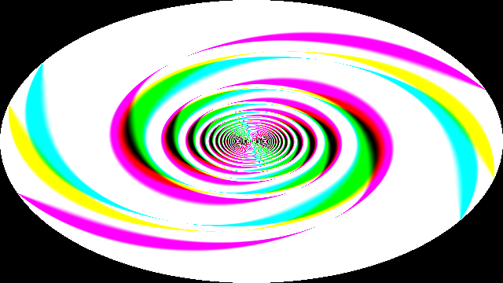
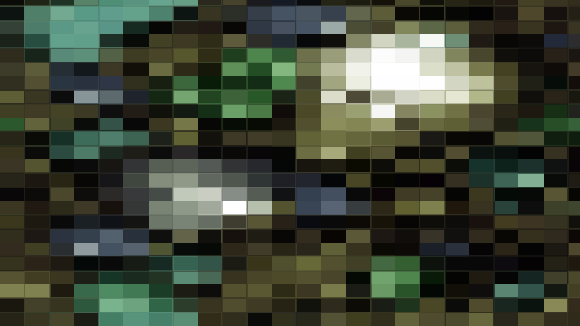
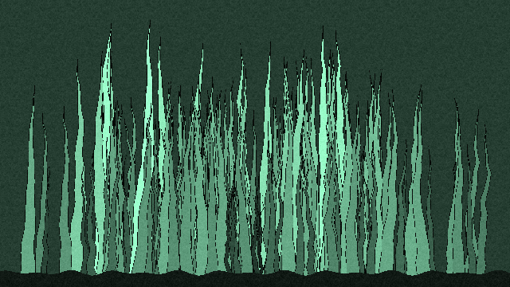
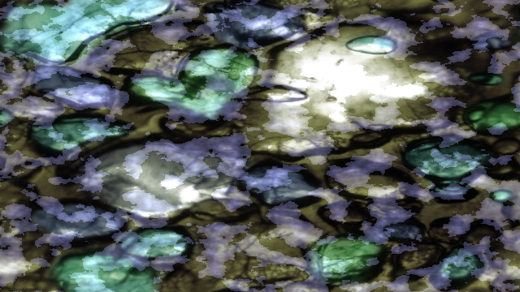
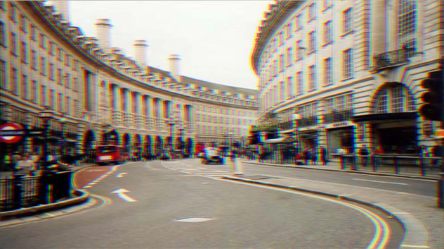

# Eksempler
Her er en liste av ting jeg har laget på fritiden. Typisk ***raskt*** i løpet av en kveld.
Mange av de er ganske uferdige

Alle disse er laget i shadertoy, som er en annen online GLSL editor. Den er litt ustabil, så valgte å ikke bruke denne i dag
* [Spiral-ting jeg lagde](https://www.shadertoy.com/view/dlySWw)

* [Pikselering av et bilde](https://www.shadertoy.com/view/XXjyRh)

* [Bakgrunnen på PCen min](https://www.shadertoy.com/view/MctSDf) *(Warning!!: meget uoptimal)*

* ["Vann" grafikk](https://www.shadertoy.com/view/l3fyz2) *Uferdig*

* [Chromatic Abberation](https://www.shadertoy.com/view/ctKXRV)

*Raskt er vell en løgn, tar en del tid 😅

